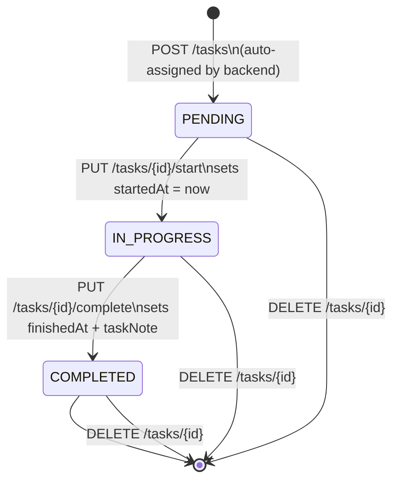
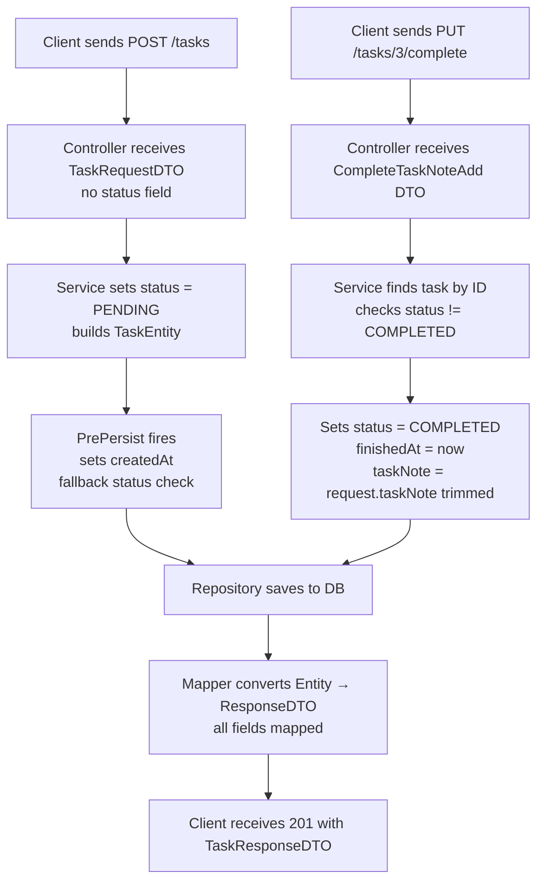

# 🧠 FocusPlanner Backend — Bug Log & Learning Notes

> **Project:** `FocusPlannerBackend` · Spring Boot + PostgreSQL + JPA
> **Topic:** Task Status Lifecycle, Auto-Status Assignment, Complete Task Flow
> **Type:** Real debugging session converted into structured revision notes

---

## 📑 Table of Contents

1. [Bug #1 — Status Exposed in Request DTO](#bug-1--status-exposed-in-request-dto)
2. [Bug #2 — Two `@PrePersist` Methods on Same Entity](#bug-2--two-prepersist-methods-on-same-entity)
3. [Bug #3 — Self-Assignment in `completeTask()`](#bug-3--self-assignment-in-completetask)
4. [Bug #4 — Controller ↔ Service Signature Mismatch](#bug-4--controller--service-signature-mismatch)
5. [Bug #5 — `taskNote` Not Appearing in GET Response](#bug-5--tasknote-not-appearing-in-get-response)
6. [❌ Mistakes Summary](#-mistakes-summary)
7. [⚡ Golden Debug Rules](#-golden-debug-rules)
8. [🔄 Task Lifecycle — State Machine](#-task-lifecycle--state-machine)
9. [🚀 Clean Backend Flow](#-clean-backend-flow)
10. [🧠 Final Key Lesson](#-final-key-lesson)

---

## Bug #1 — Status Exposed in Request DTO

### Problem

`Status` was declared in `TaskRequestDTO` with `@NotNull`, meaning the frontend/Postman **had to send it manually** — giving the user control over a field the backend should own.

```java
// ❌ WRONG — user should never control status at creation
@NotNull(message = "Status is required")
private Status status;
```

### Cause

The developer included `status` in the DTO thinking it was required input, but **status is a backend-controlled lifecycle field**, not user input.

### Fix

**Remove `status` from `TaskRequestDTO` entirely.**

```java
// ✅ CORRECT TaskRequestDTO — no status field
@Data
public class TaskRequestDTO {

    @NotBlank(message = "Title is required")
    @Size(max = 100, message = "Title cannot exceed 100 characters")
    private String title;

    @NotBlank(message = "Description is required")
    @Size(max = 300, message = "Description cannot exceed 300 characters")
    private String description;

    @NotNull(message = "Priority is required")
    private Priority priority;

    @NotNull(message = "ForWhen is required")
    private ForWhen forWhen;
}
```

**Set status in the service layer:**

```java
// ✅ Service layer controls status — always
TaskEntity task = TaskEntity.builder()
        .title(request.getTitle())
        .description(request.getDescription())
        .priority(request.getPriority())
        .forWhen(request.getForWhen())
        .status(Status.PENDING)   // ← backend decides, not frontend
        .build();
```

### Key Insight

> 🧠 **The frontend decides what to create. The backend decides what state it starts in.**
> Exposing lifecycle fields like `status` in a request DTO is both a design flaw and a security risk — a user could send `"status": "COMPLETED"` at creation time and bypass all business rules.

| Approach | Who controls status | Safe? | Correct? |
|---|---|---|---|
| Status in DTO | Frontend / Postman | ❌ No | ❌ No |
| Status in Service layer | Backend | ✅ Yes | ✅ Yes |
| Default on Entity field | Backend (fallback) | ✅ Yes | ✅ Yes (extra safety) |

---

## Bug #2 — Two `@PrePersist` Methods on Same Entity

### Problem

Two separate `@PrePersist` methods were declared on `TaskEntity`. JPA only calls **one** `@PrePersist` per entity — behavior becomes unpredictable and logic gets split.

```java
// ❌ WRONG — duplicate @PrePersist, split logic
@PrePersist
public void prePersist() {
    createdAt = LocalDateTime.now();
}

@PrePersist
public void prePersistNote() {
    createdAt = LocalDateTime.now();
    if (status == null) {
        status = Status.PENDING;
    }
}
```

### Cause

Logic was added in a second method without removing the first.

### Fix

**Merge everything into a single `@PrePersist` method.**

```java
// ✅ CORRECT — one @PrePersist, all pre-save logic together
@PrePersist
public void prePersist() {
    createdAt = LocalDateTime.now();

    if (status == null) {
        status = Status.PENDING;   // safety fallback
    }
}
```

Also add the field-level default as a **first line of defense:**

```java
@Enumerated(EnumType.STRING)
@Column(nullable = false)
private Status status = Status.PENDING;   // initialized before persist
```

### Key Insight

> 🧠 Use **both** layers of protection: field-level default + `@PrePersist` null-check.
> The field default fires at object construction. `@PrePersist` fires just before INSERT.
> Together they guarantee `status` is never `null` regardless of how the object was built.

---

## Bug #3 — Self-Assignment in `completeTask()`

### Problem

A useless self-assignment line was written before the actual conditional update, masking the real logic and causing confusion during debugging.

```java
// ❌ WRONG — does absolutely nothing, just misleads
task.setTaskNote(task.getTaskNote());

// This line then correctly overwrites it — but the first line is noise
if (note.getTaskNote() != null && !note.getTaskNote().isBlank()) {
    task.setTaskNote(note.getTaskNote().trim());
}
```

### Cause

Likely copy-paste error or confusion about how to set the value. The developer wrote a getter where a setter argument was needed.

### Fix

**Delete the self-assignment line entirely.**

```java
// ✅ CORRECT — clean conditional assignment only
if (request != null
        && request.getTaskNote() != null
        && !request.getTaskNote().isBlank()) {
    task.setTaskNote(request.getTaskNote().trim());
}
```

### Key Insight

> 🧠 `task.setX(task.getX())` is always a no-op. It never changes any value and it silently hides bugs during debugging because the field *appears* to be touched.

---

## Bug #4 — Controller ↔ Service Signature Mismatch

### Problem

The controller passed a `CompleteTaskNoteAdd` DTO object into a service method that declared its parameter as `String`. Inside the service, the code then called `.getTaskNote()` on the `String` — which does not compile.

```java
// ❌ Controller passes a DTO
taskService.completeTask(id, taskNote);  // taskNote = CompleteTaskNoteAdd object

// ❌ Service receives a String
public TaskResponseDTO completeTask(Long id, String note) { ... }

// ❌ Then calls DTO method on a String — compile error
note.getTaskNote();
```

### Cause

The developer switched between two approaches (raw `String` vs DTO) mid-implementation without updating both sides consistently.

### Fix

**Pick one approach and apply it consistently across controller, service interface, and service implementation.**

**Controller:**
```java
// ✅ Receives and passes DTO
@PutMapping("/{id}/complete")
public ResponseEntity<TaskResponseDTO> completeTask(
        @PathVariable Long id,
        @RequestBody CompleteTaskNoteAdd request) {

    return ResponseEntity.ok(taskService.completeTask(id, request));
}
```

**Service interface:**
```java
// ✅ Declares DTO parameter
TaskResponseDTO completeTask(Long id, CompleteTaskNoteAdd request);
```

**Service implementation:**
```java
// ✅ Full clean implementation
@Override
public TaskResponseDTO completeTask(Long id, CompleteTaskNoteAdd request) {

    TaskEntity task = repository.findById(id)
            .orElseThrow(() -> new RuntimeException("Task with id " + id + " not found"));

    if (task.getStatus() == Status.COMPLETED) {
        throw new IllegalStateException("Task is already completed.");
    }

    task.setStatus(Status.COMPLETED);
    task.setFinishedAt(LocalDateTime.now());

    if (request != null
            && request.getTaskNote() != null
            && !request.getTaskNote().isBlank()) {
        task.setTaskNote(request.getTaskNote().trim());
    }

    return mapper.mapToResponse(repository.save(task));
}
```

**DTO:**
```java
// ✅ Simple, single-purpose
@Data
public class CompleteTaskNoteAdd {
    private String taskNote;
}
```

### Key Insight

> 🧠 A service method signature mismatch between the interface, implementation, and caller is **the most common source of compile errors in layered Spring Boot apps.** Always update all three together.

| Layer | Must agree on |
|---|---|
| Controller | parameter type passed to service |
| Service interface | declared parameter type |
| Service implementation (`@Override`) | exact same signature as interface |

---

## Bug #5 — `taskNote` Not Appearing in GET Response

### Problem

`PUT /tasks/{id}/complete` saved the note successfully (confirmed in DB), but `GET /tasks` returned `null` for `taskNote`.

### Cause

The field was **missing from the mapper's response-building method.** The mapper built the `TaskResponseDTO` from the entity but never called `.taskNote(task.getTaskNote())` — so the field was silently dropped from every response.

### Fix

**Add the missing field to `mapToResponse()` in the mapper.**

```java
// ✅ Complete mapToResponse — every entity field must be mapped
public TaskResponseDTO mapToResponse(TaskEntity task) {
    return TaskResponseDTO.builder()
            .id(task.getId())
            .title(task.getTitle())
            .description(task.getDescription())
            .priority(task.getPriority())
            .status(task.getStatus())
            .forWhen(task.getForWhen())
            .createdAt(task.getCreatedAt())
            .startedAt(task.getStartedAt())
            .finishedAt(task.getFinishedAt())
            .taskNote(task.getTaskNote())   // 🔥 this line was missing
            .build();
}
```

### Debug Checklist When a Field Shows `null` in Response

```
Step 1 → Check DB directly
         SELECT task_note FROM task_table WHERE id = ?;
         ├── DB is null  → problem is in save/update (service or entity)
         └── DB has data → problem is in mapper or DTO

Step 2 → Check mapper
         Is .taskNote(task.getTaskNote()) present in mapToResponse()?

Step 3 → Check DTO
         Is taskNote declared as a field in TaskResponseDTO?

Step 4 → Check request JSON (Postman)
         { "taskNote": "..." }  ← key name must match DTO field exactly
```

### Key Insight

> 🧠 **"DB has the data but API returns null"** always means the mapper is not including that field.
> Always add a new entity field to **four places simultaneously:** entity → mapper → response DTO → request DTO (if applicable).

---

## ❌ Mistakes Summary

| # | Mistake | Why It's Wrong | Fix |
|---|---|---|---|
| 1 | `status` in `TaskRequestDTO` | Frontend controls a backend lifecycle field | Remove from DTO; set in service |
| 2 | Two `@PrePersist` methods | Split logic, unpredictable execution | Merge into one method |
| 3 | `task.setTaskNote(task.getTaskNote())` | No-op self-assignment, hides bugs | Delete the line |
| 4 | `String note` but calling `note.getTaskNote()` | `String` has no such method — compile error | Use `CompleteTaskNoteAdd request` consistently |
| 5 | Missing `.taskNote()` in mapper | Field silently dropped from every response | Add to `mapToResponse()` |
| 6 | Wrong JSON key in Postman (`"note"` vs `"taskNote"`) | Jackson maps by field name — wrong key = null | Match key exactly to DTO field name |
| 7 | `@Column(updatable = false)` on mutable fields | JPA ignores UPDATE statements for that column | Only use for `createdAt` and truly immutable fields |

---

## ⚡ Golden Debug Rules

```
⚡ Rule 1 — DB has data, API shows null
          → Mapper is missing the field
          → Check mapToResponse()

⚡ Rule 2 — API receives correct request, but DB is empty
          → Service not setting the field
          → Or @Column(updatable = false) is blocking the UPDATE

⚡ Rule 3 — Both DB and API are null
          → Request JSON has the wrong key
          → Or service is never called (controller routing issue)

⚡ Rule 4 — Compile error on `.getXxx()` on a String
          → Method signature mismatch between layers
          → Controller, interface, and implementation must all agree

⚡ Rule 5 — Never trust only Postman
          → Always verify with a direct DB query after any PUT/POST

⚡ Rule 6 — If you add a field to an entity
          → Update mapper + response DTO + (if needed) request DTO
          → All four, every time, no exceptions
```

---

## 🔄 Task Lifecycle — State Machine



### State Transition Guards

| From | To | Allowed? | Guard in service |
|---|---|---|---|
| `PENDING` | `IN_PROGRESS` | ✅ | — |
| `IN_PROGRESS` | `COMPLETED` | ✅ | — |
| `COMPLETED` | `IN_PROGRESS` | ❌ | `throw IllegalStateException` |
| `COMPLETED` | `COMPLETED` | ❌ | `throw IllegalStateException` |
| *(any)* | `PENDING` via DTO | ❌ | `status` not in request DTO |

---

## 🚀 Clean Backend Flow



### Layer Responsibilities — Quick Reference

| Layer | Job | What it must NOT do |
|---|---|---|
| `Controller` | Receive HTTP, delegate to service | Contain business logic |
| `Service` | Business rules, state transitions | Talk to DB directly |
| `Repository` | DB queries only | Contain logic |
| `Entity` | DB schema + lifecycle hooks | Contain business rules |
| `DTO` | Shape of API input/output | Reference entity classes |
| `Mapper` | Entity ↔ DTO conversion | Contain logic or DB calls |

---

## 🧠 Final Key Lesson

> Most backend bugs in Spring Boot are **not** logic bugs.
> They are **plumbing bugs** — a field not mapped, a signature not matching, a wrong JSON key, an annotation blocking an update.

Before assuming business logic is broken, always run this mental checklist:

```
1. Is the request JSON key exactly matching the DTO field name?
2. Is the service method signature consistent across controller, interface, and impl?
3. Is the mapper including every field in mapToResponse()?
4. Is there an @Column(updatable = false) silently blocking the UPDATE?
5. Is the field actually declared in the response DTO?
```

**If all five are correct, then and only then dig into business logic.**

---

*Part of the `SharwanKunwar/Second-Semester` · FocusPlannerBackend project log.*