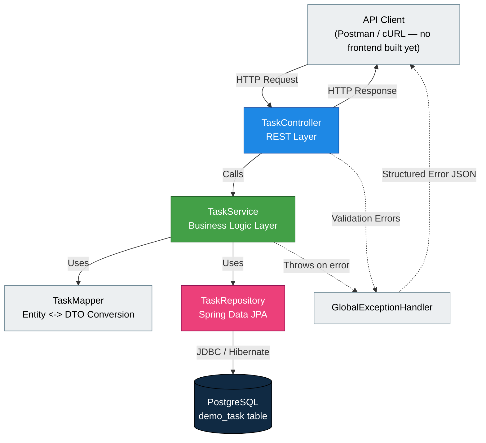
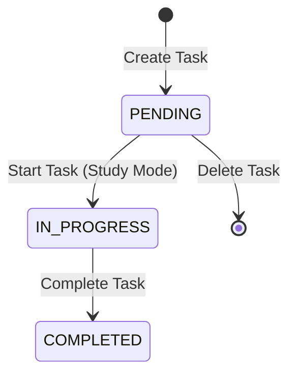
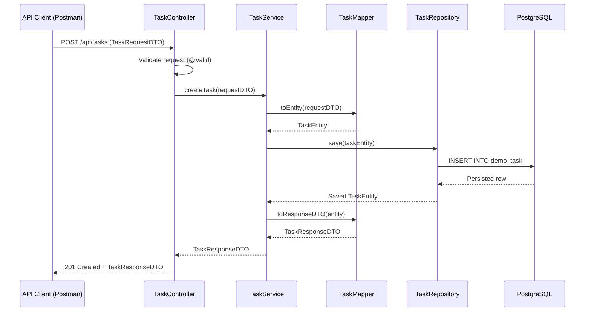
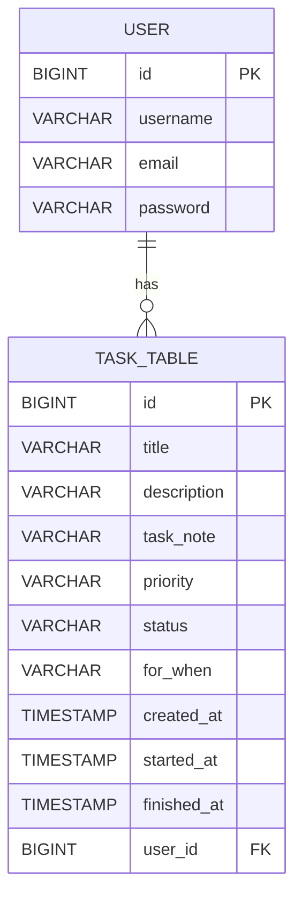
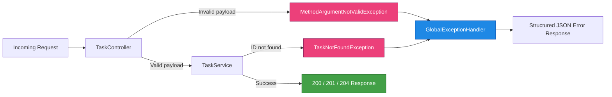

<div align="center">

# FOCUSPLANNER
### Task Management and Productivity System

#### A Backend Project Report Submitted in Partial Fulfillment of the Requirements for the Degree of Bachelor in Computer Application / Computer Science


</div>

---

## Acknowledgement

I would like to express my sincere gratitude to my course instructors and project supervisors for their continuous guidance and support throughout the development of this project, **FocusPlanner — Task Management and Productivity System**. Their valuable feedback and encouragement helped me understand backend development practices, RESTful API design, and clean architecture principles more deeply.

I am also thankful to my college for providing the academic environment and resources necessary to design, develop, and document this project. Finally, I extend my appreciation to my peers for their support and constructive discussions during the development process.

---

## Abstract

**FocusPlanner** is a backend REST API application built using **Spring Boot** that enables users to manage personal tasks efficiently. The system allows users to create tasks, assign priorities, schedule them for a specific time frame (Today or Tomorrow), and track their lifecycle from creation to completion.

The application follows a **layered architecture** consisting of Entity, DTO, Repository, Service, Mapper, and Controller layers, ensuring separation of concerns, maintainability, and scalability. Data is persisted using **Spring Data JPA** with a **PostgreSQL** database, and input validation is enforced using **Jakarta Bean Validation**. A centralized **Global Exception Handler** ensures consistent and predictable error responses across the API.

This is a **backend-only** project — no frontend interface has been developed at this stage. All APIs are designed to be tested and consumed independently using tools such as Postman, and are ready for integration with a frontend client in a future phase.

This report documents the complete design, architecture, database schema, API specification, and error-handling strategy of the FocusPlanner backend system, along with its advantages, limitations, and scope for future enhancement.

---

## 1. Introduction

In today's fast-paced academic and professional environments, effective task management plays a critical role in maintaining productivity. Many existing task management tools are either overly complex or lack a clean, extensible backend architecture suitable for learning real-world software engineering practices.

**FocusPlanner** was developed to address this gap by providing a lightweight, well-structured **Task Management and Productivity System** at the backend level. It exposes a set of RESTful APIs that allow a client (web, mobile, or testing tool such as Postman) to perform full lifecycle operations on tasks — from creation to completion or deletion.

The project was built as a practical exercise in applying **Spring Boot**, **Spring Data JPA**, **Lombok**, and **Jakarta Validation** in a real, layered backend application, while strictly following clean architecture and separation-of-concerns principles.

> **Scope Note:** This project and report cover the **backend REST API only**. No frontend (web or mobile) client has been developed at this stage — all endpoints are designed to be consumed and tested independently via tools such as **Postman** or **cURL**, or by any future client application. Frontend development is identified as a future enhancement (see Section 13).

---

## 2. Objectives

The primary objectives of the FocusPlanner project are:

1. To design and implement a RESTful backend API for task management using Spring Boot.
2. To apply a clean, layered software architecture (Entity → DTO → Mapper → Repository → Service → Controller).
3. To implement task lifecycle management (Pending → In Progress → Finished).
4. To enforce robust input validation using Jakarta Validation annotations.
5. To implement centralized exception handling for consistent and predictable API error responses.
6. To design a normalized and constraint-driven database schema using PostgreSQL.
7. To demonstrate enum-based domain modeling for priority, status, and scheduling fields.
8. To produce complete, professional technical documentation of the system for academic submission.

---

## 3. Technology Stack

| Layer | Technology | Purpose |
|---|---|---|
| Language | Java 17+ | Core programming language |
| Framework | Spring Boot | Application framework and auto-configuration |
| Persistence | Spring Data JPA (Hibernate) | ORM and database abstraction |
| Database | PostgreSQL | Relational data storage |
| Validation | Jakarta Validation (Bean Validation) | Request payload validation |
| Boilerplate Reduction | Lombok | Auto-generates getters, setters, constructors |
| API Style | RESTful Web Services | Client-server communication over HTTP |
| Build Tool | Maven | Dependency management and build lifecycle |
| Testing Tool | Postman | Manual API testing during development |

---

## 4. System Architecture

FocusPlanner follows a **layered (N-tier) architecture**, a widely accepted design pattern in enterprise backend systems. Each layer has a single, well-defined responsibility, and communication only flows in one direction — from the Controller down to the Database, and back up as a response.

### 4.1 Architectural Diagram



### 4.2 Layer Responsibilities

| Layer | Responsibility |
|---|---|
| **Controller** | Exposes REST endpoints, handles HTTP requests/responses |
| **Service** | Implements business logic and task lifecycle rules |
| **Mapper** | Converts between Entity and DTO objects |
| **Repository** | Handles database operations via Spring Data JPA |
| **Entity** | Represents the database table structure |
| **DTO** | Defines the shape of data exchanged with clients |
| **Exception Handler** | Centralizes error handling across the application |

This separation ensures that **business logic is isolated from persistence logic**, and that **internal entity structures are never directly exposed to API consumers** — a key clean architecture principle.

### 4.3 Project Package Structure

```
com.focusplanner
├── controller
│   └── TaskController.java
├── service
│   ├── TaskServiceHelper.java
│   └── TaskServiceImpl.java
├── repository
│   └── TaskRepository.java
├── entity
│   └── TaskEntity.java
├── dto
    ├── ApiErrorResponse.java
│   ├── TaskRequestDTO.java
│   └── TaskResponseDTO.java
├── mapper
│   └── TaskMapper.java
├── enums
│   ├── Priority.java
│   ├── TaskStatus.java
│   └── ForWhen.java
├── exception
│   ├── TaskNotFoundException.java
│   └── GlobalExceptionHandler.java
└── FocusPlannerApplication.java
```

---

## 5. Module Description

### 5.1 Entity Layer — `TaskEntity`

The Entity layer represents the persistent data model, mapped directly to the `task_table` table in PostgreSQL using JPA annotations.

**Key fields:**

| Field | Type | Description |
|---|---|---|
| `id` | `Long` | Primary key, auto-generated |
| `title` | `String` | Task title, mandatory |
| `description` | `String` | Optional task details |
| `priority` | `Priority` (enum) | LOW / MEDIUM / HIGH, stored as STRING |
| `status` | `Status` (enum) | PENDING / IN_PROGRESS / FINISHED, stored as STRING |
| `taskNote` | `String` | taskNote | task is saved when task completed |
| `forWhen` | `ForWhen` (enum) | TODAY / TOMORROW, stored as STRING |
| `createdAt` | `LocalDateTime` | Auto-populated on creation |
| `startedAt` | `LocalDateTime` | Populated when task moves to IN_PROGRESS |
| `completedAt` | `LocalDateTime` | Populated when task moves to FINISHED |

**Example structure:**

```java
@Entity
@Table(name = "task_table")
@Getter
@Setter
@NoArgsConstructor
@AllArgsConstructor
@Builder
public class TaskEntity {

     @Id
    @GeneratedValue(strategy = GenerationType.IDENTITY)
    private Long id;

    @Column(nullable = false, length = 100)
    private  String title;

    @Column(nullable = false, length = 300)
    private String description;

    @Column(updatable = false, length = 1000)
    private String taskNote;

    @Enumerated(EnumType.STRING)
    @Column(nullable = false)
    private Priority priority;

    @Enumerated(EnumType.STRING)
    @Column(nullable = false)
    private Status status;

    @Enumerated(EnumType.STRING)
    @Column(nullable = false)
    private ForWhen forWhen;

    @Column(nullable = false, updatable = false)
    private LocalDateTime createdAt;

    private LocalDateTime startedAt;
    private LocalDateTime finishedAt;

    //This method will automatically set the createAT timestamp
    @PrePersist
    public void prePersist() {
        createdAt = LocalDateTime.now();
    }
}
```

**Enum Usage:**

```java
public enum Priority { LOW, MEDIUM, HIGH }

public enum Status { PENDING, IN_PROGRESS, FINISHED }

public enum ForWhen { TODAY, TOMORROW }
```

Using `@Enumerated(EnumType.STRING)` ensures enums are stored as **readable text** in the database (e.g. `"HIGH"`) instead of ordinal integers, making the data self-explanatory and resilient to future enum re-ordering.

---

### 5.2 DTO Layer

The DTO (Data Transfer Object) layer decouples the internal entity structure from what is exposed to API consumers. This is a core clean-architecture principle that prevents accidental exposure of internal database fields and allows the API contract to evolve independently of the persistence model.

**`TaskRequestDTO`** — used for incoming create requests:

```java
@Getter
@Setter
public class TaskRequestDTO {

    @NotBlank(message = "Title is required")
    @Size(max = 100, message = "Title cannot exceed 100 characters")
    private String title;

    @Size(max = 500, message = "Description cannot exceed 500 characters")
    private String description;

    @NotNull(message = "Priority is required")
    private Priority priority;

    @NotNull(message = "forWhen is required")
    private ForWhen forWhen;
}
```

**`TaskResponseDTO`** — used for outgoing responses:

```java
@Getter
@Setter
@Builder
public class TaskResponseDTO {
    private Long id;
    private String title;
    private String description;
    private String taskNote;
    private Priority priority;
    private Status status;
    private ForWhen forWhen;
    private LocalDateTime createdAt;
    private LocalDateTime startedAt;
    private LocalDateTime finishedAt;
}
```

**Validation annotations used:**

| Annotation | Purpose |
|---|---|
| `@NotBlank` | Ensures string fields are not null and not empty/whitespace |
| `@NotNull` | Ensures object/enum fields are provided |
| `@Size(max=...)` | Restricts string length to prevent oversized input |

---

### 5.3 Repository Layer — `TaskRepository`

The Repository layer uses **Spring Data JPA** to abstract away raw SQL/JDBC code. By extending `JpaRepository`, the interface automatically inherits standard CRUD operations, and custom finder methods can be declared using Spring's method-name query derivation.

```java
public interface TaskRepository extends JpaRepository<TaskEntity, Long> {
    List<TaskEntity> findTaskByForWhen(ForWhen forWhen);
}
```

Spring Data JPA parses the method name `findTaskByForWhen` and automatically generates the equivalent SQL query at runtime — no manual implementation is required.

---

### 5.4 Service Layer

The Service layer contains all **business logic**, including task lifecycle rules, and acts as the boundary between the Controller and the persistence layer.

```java
public interface TaskServiceHelper 
{
    // This method will help to add a new task to the database
    TaskResponseDTO createTask(TaskRequestDTO request);

    // This method will retrieve all tasks from the database
    List<TaskResponseDTO> getAllTasks();

    // This method will retrieve all tasks based on the selected ForWhen category
    List<TaskResponseDTO> getAllTasksByForWhen(ForWhen forWhen);

    // This method will retrieve a task using its unique ID
    TaskResponseDTO getTaskById(Long id);

    // This method will start a task by updating its status and start time
    TaskResponseDTO startTask(Long id);

    // This method will mark a task as completed, record its completion time and task note if available
    TaskResponseDTO completeTask(Long id);

    // This method will delete a task from the database using its ID
    void deleteTaskById(Long id);
}
```

**Key business rules enforced in `TaskServiceImpl`:**

- A task can only be **started** if its current status is `PENDING`.
- A task can only be **completed** if its current status is `IN_PROGRESS`.
- A taskNote can only be **saved** if task status is `completed`.
- Attempting to fetch, start, complete, or delete a task with a non-existent ID throws a `TaskNotFoundException`.
- `startedAt` and `completedAt` timestamps are automatically set during the respective lifecycle transitions.

```java
@Override
    public TaskResponseDTO startTask(Long id)
    {
        TaskEntity task = repository.findById(id).orElseThrow(()-> new RuntimeException("Task with id " + id + " not found"));

        if (task.getStatus() == Status.COMPLETED) {
            throw new IllegalStateException("Completed tasks cannot be started.");
        }

        task.setStatus(Status.IN_PROGRESS);
        task.setStartedAt(LocalDateTime.now());

        return mapper.mapToResponse(repository.save(task));
    }
```

---

### 5.5 Mapper Layer — `TaskMapper`

The Mapper layer is solely responsible for **converting between Entity and DTO objects**, keeping this concern out of the Service layer and improving testability and readability.

```java
@Component
public class TaskMapper
{
    //ToEntity
    public TaskEntity mapToEntity(TaskRequestDTO request){
        return TaskEntity.builder()
                .title(request.getTitle())
                .description(request.getDescription())
                .priority(request.getPriority())
                .status(request.getStatus())
                .forWhen(request.getForWhen())
                .createdAt(LocalDateTime.now())
                .build();
    }

    //ToResponse
    public TaskResponseDTO mapToResponse(TaskEntity task){
        return TaskResponseDTO.builder()
                .id(task.getId())
                .title(task.getTitle())
                .description(task.getDescription())
                .priority(task.getPriority())
                .status(task.getStatus())
                .forWhen(task.getForWhen())
                .createdAt(task.getCreatedAt())
                .startedAt(task.getStartedAt())
                .finishedAt(task.getFinishedAt())
                .build();
    }

}
```

This isolation follows the **single responsibility principle** — if the API contract changes, only the Mapper needs to change, not the Service's business logic.

---

### 5.6 Controller Layer — `TaskController`

The Controller layer exposes REST endpoints, delegates processing to the Service layer, and wraps responses using `ResponseEntity` to control HTTP status codes explicitly.

```java
@RestController
@RequiredArgsConstructor
@RequestMapping("/api/tasks")
public class TaskController {

    private final TaskServiceHelper taskService;

    // Create a new task and save it to the database
    @PostMapping
    public ResponseEntity<TaskResponseDTO> addTask(@Valid @RequestBody TaskRequestDTO request) {
        return ResponseEntity.status(HttpStatus.CREATED)
                .body(taskService.createTask(request));
    }

    // Retrieve all tasks from the database
    @GetMapping
    public ResponseEntity<List<TaskResponseDTO>> getAllTasks() {
        return ResponseEntity.ok(taskService.getAllTasks());
    }

    // Retrieve tasks filtered by "forWhen" category (e.g., TODAY, TOMORROW, LATER)
    @GetMapping("/filter/forWhen/{forWhen}")
    public ResponseEntity<List<TaskResponseDTO>> getTasksByForWhen(@PathVariable ForWhen forWhen) {
        return ResponseEntity.ok(taskService.getAllTasksByForWhen(forWhen));
    }

    // Retrieve a single task by its unique ID
    @GetMapping("/id/{id}")
    public ResponseEntity<TaskResponseDTO> getTaskById(@PathVariable Long id) {
        return ResponseEntity.ok(taskService.getTaskById(id));
    }

    // Mark a task as "in progress" or started
    @PutMapping("/{id}/start")
    public ResponseEntity<TaskResponseDTO> startTask(@PathVariable Long id) {
        return ResponseEntity.ok(taskService.startTask(id));
    }

    // Mark a task as completed
    @PutMapping("/{id}/complete")
    public ResponseEntity<TaskResponseDTO> completeTask(@PathVariable Long id) {
        return ResponseEntity.ok(taskService.completeTask(id));
    }

    // Delete a task permanently by ID
    @DeleteMapping("/{id}")
    public ResponseEntity<Void> deleteTask(@PathVariable Long id) {
        taskService.deleteTaskById(id);
        return ResponseEntity.noContent().build();
    }
}
```

The use of `@Valid` triggers automatic validation of the `TaskRequestDTO` before the method body executes, and any violations are intercepted by the `GlobalExceptionHandler`.

---

### 5.7 Exception Handling Layer

A centralized exception handling strategy ensures that **all errors across the application return a consistent, predictable JSON structure**, regardless of which layer they originate from.

```java
@RestControllerAdvice
public class GlobalExceptionHandler {

    // HANDLE GENERIC EXCEPTION
    @ExceptionHandler(RuntimeException.class)
    public ResponseEntity<ApiErrorResponse> handleRuntimeException(RuntimeException ex)
    {

        ApiErrorResponse error = ApiErrorResponse.builder()
                .success(false)
                .message(ex.getMessage())
                .timestamp(LocalDateTime.now())
                .build();

        return ResponseEntity
                .status(HttpStatus.BAD_REQUEST)
                .body(error);
    }

    // HANDLE ILLEGAL ARGUMENT
    @ExceptionHandler(IllegalArgumentException.class)
    public ResponseEntity<ApiErrorResponse> handleIllegalArgument(IllegalArgumentException ex) {

        ApiErrorResponse error = ApiErrorResponse.builder()
                .success(false)
                .message(ex.getMessage())
                .timestamp(LocalDateTime.now())
                .build();

        return ResponseEntity
                .status(HttpStatus.BAD_REQUEST)
                .body(error);
    }

    // FALLBACK (CATCH ALL)
    @ExceptionHandler(Exception.class)
    public ResponseEntity<ApiErrorResponse> handleGenericException(Exception ex) {

        ApiErrorResponse error = ApiErrorResponse.builder()
                .success(false)
                .message("Something went wrong: " + ex.getMessage())
                .timestamp(LocalDateTime.now())
                .build();

        return ResponseEntity
                .status(HttpStatus.INTERNAL_SERVER_ERROR)
                .body(error);
    }
}
```

---

## 6. Task Lifecycle

A task in FocusPlanner moves through a well-defined set of states. Only forward transitions are allowed through the API. Deletion is permitted **only** while a task is **PENDING** — once a task has been started (**IN_PROGRESS**) or finished (**COMPLETED**), it can no longer be deleted.



This lifecycle model ensures predictable state transitions and prevents invalid operations, such as completing a task that has not yet been started, or deleting a task that is currently in progress or already completed.

---

## 7. Request Flow (Sequence Diagram)

The following diagram illustrates the flow of a **Create Task** request through all architectural layers:



---

## 8. Database Design

### 8.1 Table: `task_table`

| Column | Type | Constraints |
|---|---|---|
| `id` | `BIGSERIAL` | PRIMARY KEY, AUTO INCREMENT |
| `title` | `VARCHAR(100)` | NOT NULL |
| `description` | `VARCHAR(300)` | NOT NULL |
| `task_note` | `VARCHAR(1000)` | NULLABLE, INSERT ONLY (`updatable = false`) |
| `priority` | `VARCHAR(20)` | NOT NULL, CHECK (`LOW`, `MEDIUM`, `HIGH`) |
| `status` | `VARCHAR(20)` | NOT NULL, CHECK (`PENDING`, `IN_PROGRESS`, `FINISHED`) |
| `for_when` | `VARCHAR(20)` | NOT NULL, CHECK (`TODAY`, `TOMORROW`) |
| `created_at` | `TIMESTAMP` | NOT NULL, AUTO GENERATED (`@PrePersist`), INSERT ONLY |
| `started_at` | `TIMESTAMP` | NULLABLE |
| `finished_at` | `TIMESTAMP` | NULLABLE |

### 8.2 Entity-Relationship Diagram



> **Note**: Each task is associated with a single user through the user_id foreign key. This creates a one-to-many (1:N) relationship where one user can have multiple tasks. Future versions may introduce additional entities such as categories and reminders.

### 8.3 Enum Storage Strategy

All enum fields (`priority`, `status`, `for_when`) are stored as `VARCHAR` using `EnumType.STRING` rather than `EnumType.ORDINAL`. This design choice was made deliberately:

- **Readability:** Database values like `'HIGH'` are self-explanatory compared to ordinal values like `2`.
- **Safety:** Reordering or inserting new enum constants in Java does not corrupt existing data, which would happen with ordinal-based storage.
- **Database-level integrity:** PostgreSQL `CHECK` constraints can validate that only allowed string values are inserted, providing a second layer of defense beyond application-level enum typing.

Example check constraint:

```sql
ALTER TABLE demo_task
ADD CONSTRAINT chk_priority CHECK (priority IN ('LOW', 'MEDIUM', 'HIGH'));

ALTER TABLE demo_task
ADD CONSTRAINT chk_status CHECK (status IN ('PENDING', 'IN_PROGRESS', 'FINISHED'));

ALTER TABLE demo_task
ADD CONSTRAINT chk_for_when CHECK (for_when IN ('TODAY', 'TOMORROW'));
```

---

## 9. API Documentation

**Base URL:** `/api/tasks`

| # | Method | Endpoint | Description |
|---|---|---|---|
| 1 | `POST` | `/api/tasks` | Create a new task |
| 2 | `GET` | `/api/tasks` | Retrieve all tasks |
| 3 | `GET` | `/api/tasks/{id}` | Retrieve a task by ID |
| 4 | `GET` | `/api/tasks/filter/forWhen/{forWhen}` | Filter tasks by TODAY / TOMORROW |
| 5 | `PUT` | `/api/tasks/{id}/start` | Start a task (mark IN_PROGRESS) |
| 6 | `PUT` | `/api/tasks/{id}/complete` | Complete a task (mark FINISHED) |
| 7 | `DELETE` | `/api/tasks/{id}` | Delete a task |

---

### 9.1 Create Task

**`POST /api/tasks`**

**Request Body:**
```json
{
  "title": "Complete Software Engineering Assignment",
  "description": "Finish unit 3 documentation and diagrams",
  "priority": "HIGH",
  "forWhen": "TODAY"
}
```

**Response — `201 Created`:**
```json
{
  "id": 1,
  "title": "Complete Software Engineering Assignment",
  "description": "Finish unit 3 documentation and diagrams",
  "priority": "HIGH",
  "status": "PENDING",
  "taskNote":null,
  "forWhen": "TODAY",
  "createdAt": "2026-06-22T09:15:00",
  "startedAt": null,
  "completedAt": null
}
```

---

### 9.2 Get All Tasks

**`GET /api/tasks`**

**Response — `200 OK`:**
```json
[
  {
    "id": 1,
    "title": "Complete Software Engineering Assignment",
    "priority": "HIGH",
    "status": "PENDING",
    "forWhen": "TODAY"
  }
]
```

---

### 9.3 Get Task by ID

**`GET /api/tasks/{id}`**

**Response — `200 OK`:**
```json
{
  "id": 1,
  "title": "Complete Software Engineering Assignment",
  "description": "Finish unit 3 documentation and diagrams",
  "priority": "HIGH",
  "status": "PENDING",
  "taskNote":null,
  "forWhen": "TODAY",
  "createdAt": "2026-06-22T09:15:00"
}
```

**Response — `404 Not Found`:**
```json
{
  "status": 404,
  "error": "Not Found",
  "message": "Task not found with id: 99",
  "timestamp": "2026-06-22T09:20:00"
}
```

---

### 9.4 Filter Tasks by ForWhen

**`GET /api/tasks/filter/forWhen/{forWhen}`**

Example: `GET /api/tasks/filter/forWhen/TODAY`

**Response — `200 OK`:**
```json
[
  {
    "id": 1,
    "title": "Complete Software Engineering Assignment",
    "description": "Finish unit 3 documentation and diagrams",
    "forWhen": "TODAY",
    "status": "PENDING",
    "priority": "HIGH",
    "taskNote":null,
    "createdAt": "2026-06-22T09:15:00"
  }
]
```

---

### 9.5 Start Task

**`PUT /api/tasks/{id}/start`**

**Response — `200 OK`:**
```json
{
  "id": 1,
  "status": "IN_PROGRESS",
  "startedAt": "2026-06-22T09:30:00"
}
```

---

### 9.6 Complete Task

**`PUT /api/tasks/{id}/complete`**

**Response — `200 OK`:**
```json
{
  "id": 1,
  "status": "FINISHED",
  "completedAt": "2026-06-22T10:45:00"
}
```

---

### 9.7 Delete Task

**`DELETE /api/tasks/{id}`**

**Response — `204 No Content`**
*(empty body)*

---

## 10. Error Handling

FocusPlanner implements a centralized, layer-agnostic error handling strategy using `@RestControllerAdvice`, ensuring that every error returned by the API — regardless of origin — follows a consistent JSON shape.

### 10.1 Error Handling Flow



### 10.2 Standard Error Response Format

```json
{
  "status": 404,
  "error": "Not Found",
  "message": "Task not found with id: 25",
  "timestamp": "2026-06-22T11:05:32"
}
```

### 10.3 Validation Error Response Format

When `@Valid` fails on a `TaskRequestDTO`, field-level errors are returned as a map:

```json
{
  "title": "Title is required",
  "priority": "Priority is required"
}
```

### 10.4 Exception-to-Status Mapping

| Exception | HTTP Status | Scenario |
|---|---|---|
| `MethodArgumentNotValidException` | `400 Bad Request` | Request body fails `@Valid` constraints |
| `TaskNotFoundException` | `404 Not Found` | Task ID does not exist in database |
| `Exception` (generic fallback) | `500 Internal Server Error` | Unhandled/unexpected errors |

---

## 11. Advantages

- **Clean layered architecture** improves maintainability and makes the codebase easy to extend.
- **DTO pattern** prevents direct exposure of internal entity/database structure to clients.
- **Centralized exception handling** ensures consistent, predictable API error responses.
- **Enum-based modeling with STRING storage** keeps the database human-readable and safe from ordinal-related data corruption.
- **Stateless REST design** means the backend is fully frontend-agnostic and ready to integrate with any future client (web, mobile, or CLI) without requiring backend changes.
- **Validation at the DTO layer** stops invalid data before it reaches business logic or the database.

---

## 12. Limitations

- **No frontend client has been developed.** This project is backend-only by design; all endpoints must currently be tested using tools such as Postman or cURL.
- No authentication or authorization mechanism is currently implemented; all endpoints are publicly accessible.
- The system supports a single `Task` entity with no relational data (e.g., no user ownership, categories, or tags).
- No pagination is implemented on the `GET /api/tasks` endpoint, which may affect performance with large datasets.
- No automated test suite (unit/integration tests) is included in the current version.
- Filtering is limited to the `forWhen` field; there is no support for filtering by priority, status, or combined criteria.

---

## 13. Future Enhancements

- Develop a **frontend client** (web or mobile application) to consume this REST API and provide an end-user interface.
- Implement **JWT-based authentication and authorization** to associate tasks with individual users.
- Introduce a **`User` entity** with a one-to-many relationship to `Task`, enabling multi-user support.
- Add **pagination and sorting** (`Pageable`) to the `GET /api/tasks` endpoint.
- Extend filtering capabilities to support combined queries (priority + status + forWhen).
- Add **category/tag support** for better task organization.
- Implement **unit and integration tests** using JUnit 5 and Mockito.
- Add **Swagger/OpenAPI documentation** for interactive API exploration.
- Introduce **soft-delete** functionality instead of hard deletion, to preserve task history.
- Add **due-date and reminder/notification** features for time-sensitive tasks.

---

## 14. Conclusion

FocusPlanner successfully demonstrates the design and implementation of a **backend** Task Management and Productivity System using Spring Boot, Spring Data JPA, and PostgreSQL. This submission covers the backend REST API exclusively — no frontend has been built at this stage. The project applies industry-standard architectural practices — including layered architecture, DTO-based data exchange, enum-driven domain modeling, and centralized exception handling — to produce a clean, maintainable, and extensible backend system.

Through this project, key backend engineering concepts such as RESTful API design, ORM-based persistence, request validation, and structured error handling were applied in a practical, hands-on manner. The modular structure of FocusPlanner also lays a solid foundation for future enhancements such as authentication, multi-user support, and richer task organization features.

---

<div align="center">

**— End of Report —**

</div>
